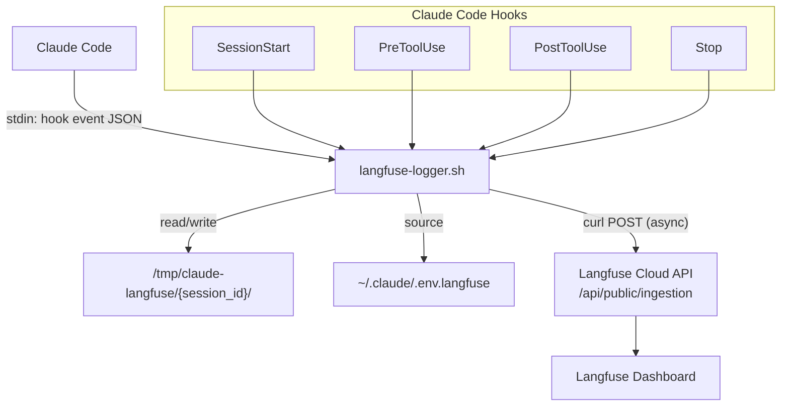
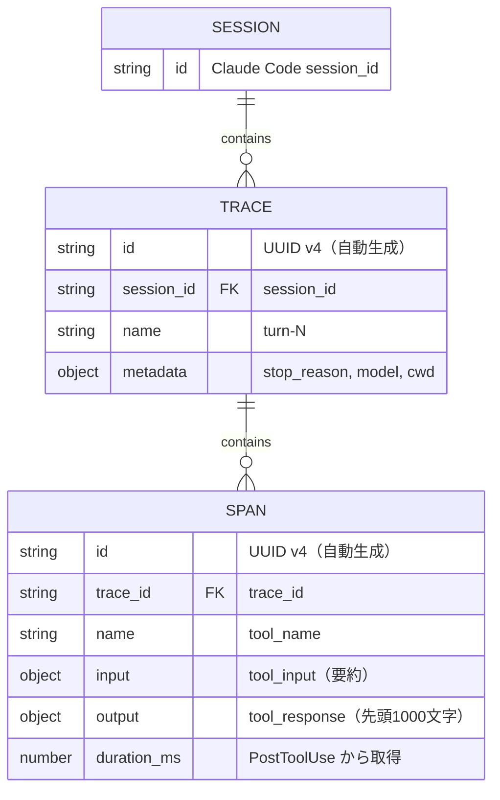
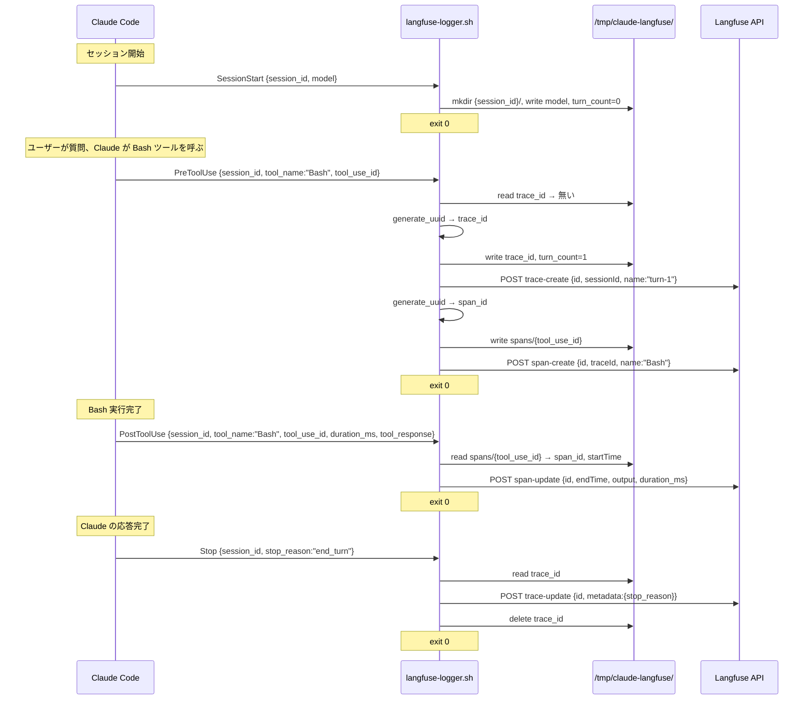
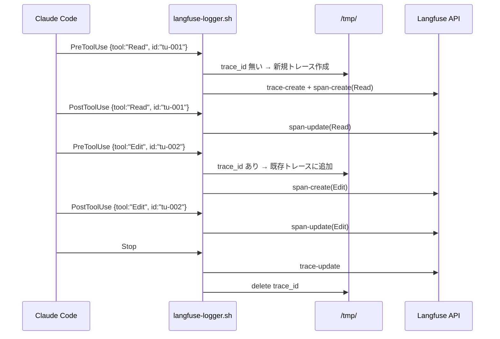
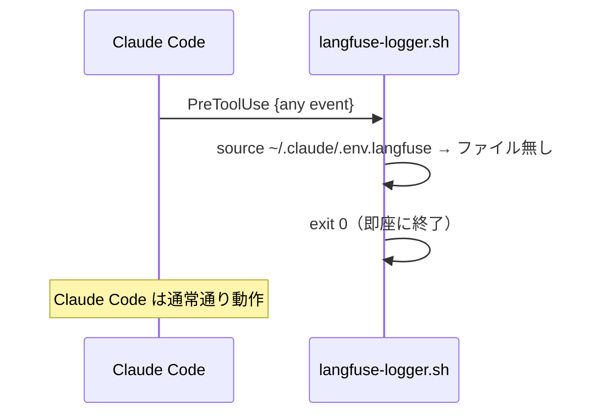

<!-- 生成日: 20260425 -->

# 機能設計書 (Functional Design Document)

## システム構成図



## 技術スタック

| 分類 | 技術 | 選定理由 |
|------|------|----------|
| 言語 | Bash | Claude Code hooks は shell command として実行される。追加ランタイム不要 |
| JSON 処理 | jq | devcontainer に標準インストール済み（`/usr/bin/jq`） |
| HTTP クライアント | curl | devcontainer に標準インストール済み。バックグラウンド実行で非同期化 |
| 状態管理 | ファイルシステム | `/tmp/` 配下。プロセス間共有・再起動時自動クリーンアップ |
| オブザーバビリティ | Langfuse Cloud | Hobby プラン（無料）。Ingestion API v1 |

## データモデル定義

### Langfuse データモデルマッピング



### ローカル状態ファイル

```
/tmp/claude-langfuse/{session_id}/
├── trace_id          # 現在のターンのトレースID（テキスト）
├── turn_count        # ターンカウンタ（数値テキスト）
├── model             # 使用モデル名（テキスト）
└── spans/
    └── {tool_use_id} # "{span_id}|{start_time}" 形式
```

### Langfuse Ingestion API ペイロード

```typescript
interface IngestionPayload {
  batch: IngestionEvent[];
}

interface IngestionEvent {
  id: string;            // UUID v4
  type: "trace-create" | "trace-update" | "span-create" | "span-update";
  timestamp: string;     // ISO 8601
  body: TraceBody | SpanBody;
}

interface TraceBody {
  id: string;
  sessionId: string;
  name: string;          // "turn-1", "turn-2", ...
  metadata?: {
    model?: string;
    cwd?: string;
    stop_reason?: string;
  };
}

interface SpanBody {
  id: string;
  traceId: string;
  name: string;          // tool_name (e.g. "Bash", "Read", "Edit")
  startTime: string;     // ISO 8601
  endTime?: string;      // ISO 8601（span-update 時）
  input?: object;        // tool_input の要約
  output?: object;       // tool_response の先頭1000文字
  metadata?: {
    tool_use_id: string;
    duration_ms?: number;
  };
}
```

## コンポーネント設計

### langfuse-logger.sh（単一スクリプト）

**責務**: フックイベントの受信、状態管理、Langfuse API への送信

```
┌─────────────────────────────────────────────────┐
│ langfuse-logger.sh                              │
│                                                 │
│ [1] 設定読み込み  ~/.claude/.env.langfuse       │
│ [2] stdin 読み取り  jq で JSON パース           │
│ [3] イベントルーティング  case 文               │
│ [4] 状態管理  /tmp/claude-langfuse/ 読み書き    │
│ [5] API 送信  curl バックグラウンド実行         │
└─────────────────────────────────────────────────┘
```

**関数一覧**:

| 関数名 | 責務 |
|--------|------|
| `generate_uuid` | bash $RANDOM で UUID v4 を生成 |
| `send_to_langfuse` | curl POST をバックグラウンドで発行 |
| `truncate_string` | 文字列を指定バイト数で切り詰め |
| `get_input_summary` | tool_input から可読な要約を生成 |
| `handle_session_start` | 状態ディレクトリ初期化、model 保存 |
| `handle_pre_tool_use` | トレース作成（必要時）、スパン作成 |
| `handle_post_tool_use` | スパン更新（duration, output） |
| `handle_stop` | トレース終了、状態リセット |

## ユースケース図

### UC1: セッション開始 → ツール呼び出し → ターン終了



### UC2: 1ターンで複数ツール呼び出し



### UC3: Langfuse 未設定時（グレースフルデグラデーション）



## ファイル構造

### プロジェクト内（リポジトリにコミット）

```
.claude/
├── hooks/
│   ├── langfuse-logger.sh     # 新規: Langfuse ロガー
│   ├── guard-aws-cli.sh       # 既存: AWS CLI ガード
│   ├── guard-secrets.sh       # 既存: シークレットガード
│   ├── guard-secrets-read.sh  # 既存: 読み取りガード
│   ├── guard-terraform.sh     # 既存: Terraform ガード
│   └── validate-commit-message.sh  # 既存: コミットメッセージ検証
└── settings.json              # 修正: フック登録追加
```

### ユーザーホーム（リポジトリ外）

```
~/.claude/
└── .env.langfuse              # 手動作成: API キー
```

### ランタイム状態（一時ファイル）

```
/tmp/claude-langfuse/
└── {session_id}/
    ├── trace_id
    ├── turn_count
    ├── model
    └── spans/
        ├── {tool_use_id_1}
        └── {tool_use_id_2}
```

## パフォーマンス最適化

- **非同期 API 送信**: `curl ... &` でバックグラウンド実行。スクリプト自体は curl 発行後すぐに `exit 0`
- **最小限の jq 呼び出し**: 必要なフィールドを1回の jq で抽出（パイプチェーンを避ける）
- **ペイロード軽量化**: `tool_response` を先頭 1000 文字に切り詰め、`tool_input` は要約のみ送信

## セキュリティ考慮事項

- **API キーの保護**: `~/.claude/.env.langfuse` はプロジェクト外に配置。`guard-secrets-read.sh` のパターン（`.env.*`）で Claude Code の Read ツールからも保護される
- **データ漏洩の抑制**: `tool_response` を 1000 文字に切り詰め。ソースコード全文が Langfuse に送信されることを防止
- **リポジトリ汚染防止**: `.gitignore` に `.env.langfuse` を追加

## エラーハンドリング

| エラー種別 | 処理 | Claude Code への影響 |
|-----------|------|---------------------|
| `.env.langfuse` 未設定 | 即座に `exit 0` | なし |
| `LANGFUSE_PUBLIC_KEY` / `SECRET_KEY` 空 | 即座に `exit 0` | なし |
| jq パースエラー | `exit 0`（stderr は /dev/null） | なし |
| Langfuse API タイムアウト（5秒） | curl バックグラウンド終了 | なし |
| Langfuse API 4xx/5xx | curl バックグラウンド終了 | なし |
| 状態ファイル書き込み失敗 | `exit 0` | なし（次イベントで再試行） |
| `tool_use_id` のスパンファイル不在（PostToolUse） | スパン更新をスキップ | なし |

**設計方針**: すべてのエラーケースで `exit 0` を返し、Claude Code の動作を一切ブロックしない。

## テスト戦略

### 手動テスト（主要な検証手段）

1. **フック動作確認**: Claude Code セッション起動後、`/hooks` でイベント登録を確認
2. **状態ファイル確認**: ツール呼び出し後に `/tmp/claude-langfuse/` の内容を `ls -la` で確認
3. **Langfuse ダッシュボード確認**: トレース・スパンの階層表示を目視確認
4. **グレースフルデグラデーション**: `.env.langfuse` を一時退避し、エラーが出ないことを確認
5. **既存ガード非干渉**: `.env` 読み取りや `terraform destroy` がブロックされることを確認

### スクリプト単体テスト（オプション）

```bash
# SessionStart イベントをシミュレート
echo '{"hook_event_name":"SessionStart","session_id":"test-123","model":"claude-opus-4-6"}' | \
  bash .claude/hooks/langfuse-logger.sh

# 状態ファイルが作成されたか確認
ls /tmp/claude-langfuse/test-123/
```
